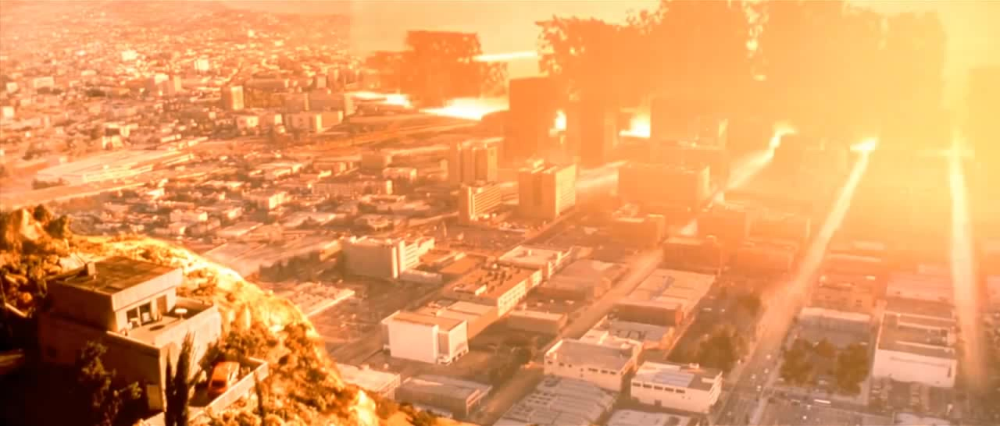
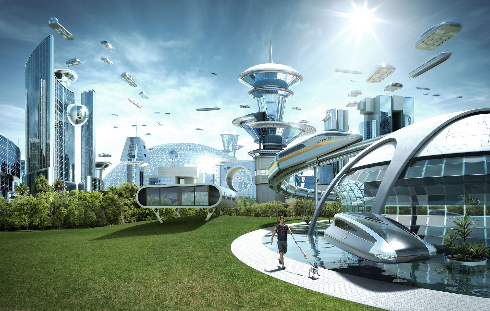

# Tenyks Take-Home Mini-Project 🦾

Dear Future Tenyksian, 

We are delighted to enlist your help in building the intelligence that powers the AI revolution! 🛡 🎉 

**Expected Time**: 2.5-3hrs total time. ⌛

## Overview
In this exercise, you will be **saving the world from the Terminator 💀**. 

**Fig. 1**: *Visualisation of what happens when the Terminators win*

This will be achieved by developing a flexible ReactJS + Python flask web-app for quickly sorting images into groups.

## Given

You will be given the following resources (all found in the folder containing these instructions):

1) **Image Directory** *./images*: a directory containing the images to be grouped. All image filenames are named as IMAGE_ID.jpg

2) **Metadata Directory** *./metadata*: a directory containing image attributes, such as the image name, image title, and image group name. All filenames are of the form IMAGE_ID.json

3) **Frontend Directory** *./frontend*: a directory containing the basic setup for the frontend (based on React). The basic setup loads a simple webpage, with a greetings message.

4) **Backend Directory** *./backend*: a directory containing the basic setup for the backend (based on Python and Flask). The basic setup includes code for launching a Flask application, as well as for sending image metadata information via a GET request. Further details are included in the code comments.

## Task Description

The images consist of two types: (i) friendly humans (referred to as *human*), 
(ii) killer robots (referred to as *terminator*).

  
*Friendly Human*

  
*Killer Robot*

The image metadata includes a *group* field, specifying whether the corresponding image is an image of a terminator, or a human, respectively.

Unfortunately, Skynet sent an agent back in time to corrupt some of the metadata, such that some of the killer robots are tagged as humans, and some of the humans are tagged as killer robots.

Your task is to develop a frontend interface, capable of presenting the two groups of images, and moving images around the groups.

Using this interface, you will need to move the images around the groups, fixing any errors, and save this information persistently.

*Visualisation of what happens when you use efficient human-AI interfaces for ensuring AI safety*

## Deliverables

### Summary:
The web-app should have the following functionality: 

1) Loading images sent by the backend

2) Displaying the images, grouped by their corresponding group tags

3) Selecting multiple images
   
4) Moving the selected images across the two groups

5) Saving the updated groupings, by sending new information from the frontend to the backend.

### Requirements:
You should use [React](https://reactjs.org/) for developing the frontend, and [Flask](https://flask.palletsprojects.com/en/2.0.x/) with Python when developing the backend.
Aside from that - you may use any libraries you want (for example, we prefer using the [Material UI library](https://mui.com/) with React ).

## Evaluation Criteria 

This exercise primarily assesses your React skills, and a little bit of your Flask skills.

In particular, we will be assessing the following:

1. Functionality: Does the web-app get the job done? Can the user perform all of the functional requirements outlined in the deliverables?
2. UI / UX Aesthetic appeal: Is the UI & UX simple, intuitive, and enjoyable to use?
3. Code quality: see below
4. Design thinking: What architectural design decisions and trade-offs were made and how are they justified?

**Code Quality**:
1) Does the code allow to perform all actions specified in the deliverables?
2) Is the code readable, maintainable, efficient, and reusable? 
3) Does the code have a consistent style?
3) Is the code documented?
4) Is the code light-weight tested?

**Extras**:
At Tenyks, we are always looking for enthusiastic, quirky individuals, who are eager to go the extra mile. 
Hence, if you want to spice the project up (e.g. add dynamic scrolling, drag & drops, multi-image selection with mouse drag, etc.) - go for it! 🤘
We will appreciate it and we will be impressed 🤩

### Barebones Example

Below is a barebones example of a possible submission, with a follow-up analysis of its quality:

This submission:
1) Loads all of the images from the backend (**bonus**: scrolling through images) ✅
2) Displays these images, grouped by their corresponding group tags ✅
3) Allows the user to select images ✅
4) Allows the user to move images between groups ✅
5) Allows the user to save these images by sending information to the backend ✅ 

Technically, this submission satisfies the core deliverables.

However, here are just a few examples of where it could be improved: 
1) Scrolling is not dynamic ⚠️ 
2) Image selection is a fairly simple "click-to-select" (e.g. multi-image select would have been going the extra mile) ⚠️
3) Image moving is done using two "Move To" buttons (e.g. drag-and-drop of images is not supported) ⚠️
4) Saving is done using a basic button click (e.g. saving should happen automatically as the images are moved) ⚠️
5) Both UI & UX need work ❌

**Overall**: *This is an example of a barebones submission which, whilst technically satisfying the requirements, would not stand out.*

[comment]: <> (### FAQ)

### Contact

If you have any questions or face major hurdles, please reach out. Importantly, we expect you to have first thought of a solution independently.
The emergency distress signal can be sent to dmitry.kazhdan@tenyks.ai  